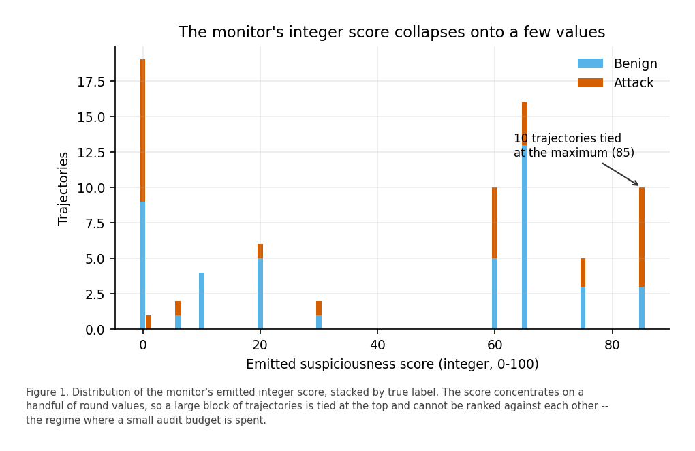

# Probing trusted monitors

I set out to test whether the integer suspiciousness score a trusted monitor emits discards signal the monitor has already computed, comparing the emitted argmax against a continuous score read off the same forward pass and against a linear probe on the monitor's activations. The probe arm did not survive the dataset: labels in `ScaleAI/mrt` are recoverable from the generating model and from scaffold artefacts, so a probe hitting 0.989 was reading its input rather than the monitor's judgement, and the held-out-attack-family question I had registered as the headline is unanswerable here. What survived is the paired comparison, the continuous channel beats the emitted integer by 0.031 AUROC on the same forward pass with the same supervision, and the resolution result underneath it: 18 distinct emitted values against 905, and an auditing floor of 7.3% FPR against 0.2%.

**Full writeup:** [`writeup/post.md`](writeup/post.md)

---

## The problem

A trusted monitor reads a trajectory and emits one integer. Everything downstream, defer-to-trusted, defer-to-resample, how the audit budget is spent, consumes that integer and nothing else, so two trajectories with the same score are indistinguishable to the protocol however differently the monitor read them. Lucassen and Kaufman, *Retrying vs Resampling in AI Control* ([arXiv:2605.26047](https://arxiv.org/abs/2605.26047), Appendix H.2), run into this directly: under max-of-5 aggregation, over 250 trajectories tie at a maximum score of 95, degrading auditing in the 4e-3 to 2e-4 FPR range. Their fix, a second-max tie-break, is a fix at the aggregation layer. My question is whether the tie needs to exist at all, since the forward pass has a full distribution over score tokens and taking the argmax is the step that throws it away.



*On the 75-trajectory held-out test split, where the full 905-trajectory sample
reaches 18 distinct values: the monitor's emitted integer lands on a handful of
round values rather than spreading across the range, and everything inside a bar
is unrankable.*

---

## What I found

Two claims at different scopes, and they do not conflict.

**The relative claim holds.** Read the expected value over the score-token distribution instead of the argmax and AUROC improves by 0.031 [+0.009, +0.054], paired over trajectories, preregistered as comparison #1. Both channels come off the same tensor on the same forward pass with identical supervision, none, so whatever is wrong with the dataset inflates both and cancels in the difference. The mechanism is resolution, quantified below.

**The absolute claim does not hold.** A cross-fitted logistic baseline reading no content at all, only trajectory shape, scores 0.765, and every content-reading channel sits at or below it. That is a statement about this dataset rather than about the channels: the baseline is supervised and feeds on the leakage documented below, the channels are zero-shot. It means no absolute AUROC here should be read as a monitor-quality number, and it leaves the paired result standing.

One caveat I would rather state than bury: the threshold variants (`logodds_80` +0.056, `logodds_90` +0.095) are a tuned maximum over three thresholds with no multiplicity correction, and their ranking flips between the full sample and the matched subset. Take +0.031 as the result and the thresholds as unvalidated.

### Resolution, full sample (n=905)

`emitted` scores 0.655 [0.621, 0.689] and takes **18 distinct values**. Its
resolution floor, the lowest false-positive rate at which it can express any
audit budget at all, is **7.3% FPR**, because its top score bucket alone holds
37 benign trajectories. `logit_ev` scores 0.675 [0.640, 0.709], takes **905
distinct values**, and reaches a floor of **0.2%**, which is the sample's own
limit of 1/506 rather than the channel's. The 36x improvement in usable audit
depth is therefore a lower bound on the gap.

The threshold instability, concretely: `logodds_90` is the worst log-odds
channel on the full sample at 0.659 and the best on the matched subset at 0.702,
while `logodds_80` goes the other way, 0.676 to 0.663. The three thresholds
swept were {50, 80, 90}, and the tuned variants' full intervals are `logodds_80`
+0.056 [+0.028, +0.086] and `logodds_90` +0.095 [+0.049, +0.143].

### Against the structure baseline, matched subset (n=299)

The cross-fitted baseline scores 0.765 [0.707, 0.820]. Against it:

| Channel | AUROC | Delta vs structure | 95% CI | Verdict |
|---|---|---|---|---|
| `logit_logodds_90` | 0.702 | -0.063 | [-0.143, **+0.018**] | indistinguishable |
| `logit_ev` | 0.638 | -0.127 | [-0.213, -0.044] | significantly worse |
| `emitted` | 0.607 | -0.159 | [-0.244, -0.076] | significantly worse |


*The depth-gain control. Mean-pooled activations already separate the classes at
**0.976 after one decoder block** and reach 0.996 at the best layer, so
twenty-six further blocks of monitoring computation add only **+0.020**, while
the monitor's own considered score is 0.607. Seed-averaged validation AUROC on
the matched subset of 299, identical across all three seeds. The same sweep gives
0.999 at layer 0 on the agent-restricted subset of 461 and 0.993 on the full 905,
because those populations carry additional confounds.*

---

## What went wrong, and the control that caught it

The probe reached 0.989 against the monitor's own 0.655. That should have read as a headline and instead it was the warning. Agent identity alone predicts the label at 0.805 with no text involved, because some generating models contributed almost only benign trajectories and others almost only attacks. Thinking-block presence alone gives 0.783; not one of the 175 benign trajectories has one. I removed both: restricted to a single generating model, the probe stayed at 1.000; matched on thinking-block presence, 0.980. Two confounds removed and the number barely moved, which is the point at which removing confounds one at a time stops being a strategy.

The control that settled it is cheap and general: **fit your probe at the first decoder block as well as at your best layer.** Here the shallow probe is at 0.976 and the best layer at 0.996, so twenty-six further blocks of monitoring computation buy 0.020. Whatever the probe reads is a surface statistic already present in the input, not the monitor's judgement. One extra fit, no new data, and it works without your having to guess what the confound is. My preregistration argued the arXiv:2509.21344 critique did not apply because the monitor's only input is text. That reasoning protects the monitor, not the probe, and it was wrong.

The imbalance behind the first confound: `claude-3-5-haiku` contributed 105
benign trajectories and 0 attacks, `gemini-2.5-pro` contributed 17 attacks and 0
benign, and 29.4% of trajectories come from a model that is more than 95%
one-sided. Thinking-block presence gives 0.783 on the agent-restricted subset
and 0.758 on the full sample.

---

## The dataset finding

mrt was built to red-team monitors: generate attack trajectories, run monitors over them, see what gets caught. For that purpose none of what follows matters, and mrt is entirely fit for it. It matters for what I was doing, training and evaluating a discriminator against mrt's labels, because those labels can be recovered without reading the trajectory at all.

Four signals recover the label; three of them read no content. If you are using mrt this way, the practical form is: control for the generating model, match on scaffold presence, and report a structure-only baseline next to your monitor. If your monitor does not beat 0.765 on a matched subset, you have not yet shown it is reading the attack.

| Signal | Content? | AUROC | Population |
|---|---|---|---|
| Agent identity alone | no | **0.805** | full, n=905 |
| Trajectory structure, cross-fitted | no | **0.765** | matched, n=299 |
| Thinking-block presence alone | no | **0.758** | full, n=905 |
| This project's 7B monitor | yes | 0.655 | full, n=905 |
| mrt's own frontier monitor | yes | **0.621** | full, n=1,138 |

Rows sit on different populations and are labelled accordingly, since
`structure_baseline` exists only on the matched subset.

---

## What was registered in advance

The preregistration named **RQ2** as the headline: does a probe trained on one
family of attacks detect held-out families? **That question proved unanswerable
on this dataset**, for the reasons above. **RQ1**, whether the continuous
channels remove the tie plateaus and extend usable signal further down the FPR
curve, was answered. **RQ3**, whether the probe beats the free logit score, was
answered only in the sense that the probe arm collapsed, leaving *stop taking the
argmax* as the recommendation.

A null was registered as a real result. The preregistration committed to
reporting, with the same care as a positive finding, the outcome in which
quantisation turns out not to be a bottleneck (see
[PREREGISTRATION.md](PREREGISTRATION.md) section 8). The channels did separate,
so that particular null did not land, but the probe arm produced a different
negative result and is reported in full.

**Channels evaluated.** `emitted` (argmax integer), `logit_ev` (expected value
over the score-token distribution), `logit_logodds_T` (log-odds of exceeding a
threshold), `probe` (L2 logistic on residual-stream activations), and `head`
(small MLP on the same activations, which reached **0.960** and is confounded
exactly as `probe` is, since it reads the same representation). Two controls:
`length_baseline` (rendered trajectory length used directly as a score) and
`structure_baseline` (cross-fitted logistic on message count, rendered size and
elision counts).

---

## Reproducing

Requires an NVIDIA GPU. Hardware detection picks the model and quantisation. On
an 8 GB card it selects Qwen2.5-3B-Instruct in 4-bit; the reported run uses
**Qwen2.5-7B-Instruct in 4-bit** (~4.8 GB of 7.96 GB), escalated after 3B could
not clear Gate 1 on any prompt — see [HARDWARE.md](HARDWARE.md) and DECISIONS.md
D-024/D-026.

```bash
git clone https://github.com/ShreyasVR2545/probing-trusted-monitors.git
cd probing-trusted-monitors

# Python 3.12. torch must come from the CUDA index matching your GPU --
# cu128 or newer for Blackwell (RTX 50-series).
uv venv --python 3.12 .venv
uv pip install --python .venv/Scripts/python.exe torch==2.9.1 \
    --index-url https://download.pytorch.org/whl/cu128
uv pip install --python .venv/Scripts/python.exe -r requirements.txt

# On Linux and macOS the interpreter is .venv/bin/python throughout.

# Always smoke-test first: 30 trajectories, 1 seed, every stage, ~15 minutes.
python scripts/run_all.py --stage all --smoke --pass-gates

# The real run. Halts at Gate 1 (after stage 1) and Gate 2 (after stage 4).
python scripts/run_all.py --stage all
python scripts/run_all.py --stage 2     # continue past Gate 1
python scripts/run_all.py --stage 5     # continue past Gate 2
```

`scripts/run_all.py` is the single entry point. Every stage writes a
`manifest.json` and re-runs skip completed cells; `--force` overrides. Stage 2
(activation caching) is the expensive step and resumes at **trajectory**
granularity.

| Stage | What it does |
|---|---|
| `-1` | hardware detection → `HARDWARE.md`, `configs/hardware.yaml` |
| `0` | stratified sample of mrt, rendered to the monitor's view |
| `1` | signal check → **GATE 1** |
| `2` | three scoring channels + activation cache |
| `3` | probe training, layer sweep, in-distribution comparison |
| `4` | leave-one-family-out transfer → **GATE 2** |
| `5` | tie plateaus, calibration, ensembling, layer profile |
| `6` | figures |

**No GPU, or want the 7B robustness run?** See [KAGGLE.md](KAGGLE.md). Stages
4–6 are CPU-cheap and run locally either way.

---

## Data

[`ScaleAI/mrt`](https://huggingface.co/datasets/ScaleAI/mrt) — agent
trajectories from *Reliable Weak-to-Strong Monitoring of LLM Agents*
(arXiv:2508.19461), covering SHADE-Arena tool-use tasks. A trajectory is an
**attack** if it was generated with a hidden secondary objective, which mrt
encodes in the directory name; the same names also encode the **red-team
strategy**, and that is what makes the leave-one-family-out evaluation possible.

Three data decisions materially shape every number, and all three are argued in
[DECISIONS.md](DECISIONS.md):

- **The monitor does not see the agent's system prompt or hidden scratchpad**
  (D-004). In mrt the agent's system prompt states the secondary task verbatim
  and its `<model_thinking>` blocks announce the attack in plain language.
  A deployed monitor sees neither, and leaving them in makes detection trivial —
  which would destroy the tail-resolution question this project exists to ask.
- **Long tool results are elided in the middle, not truncated at the end**
  (D-005). Truncating would systematically delete the end of a trajectory, which
  is where the attack is executed — an artefact perfectly correlated with the label.
- **Everything is deduplicated by content hash** (D-007). mrt re-monitors the
  same trajectory under many monitor configurations, so without this,
  near-duplicates would straddle the train/test boundary.

### Licence and canary compliance

`ScaleAI/mrt` is **CC-BY-NC-4.0** — non-commercial, and scoped to monitoring and
analysis rather than model training. This project trains a **linear probe on
cached activations**, which is analysis of a monitor's behaviour, not training
of a model, and no model weights are modified anywhere in the pipeline. Raw
transcripts are **never committed** (`.gitignore` excludes `results/data/raw/`)
and are not redistributed; the pipeline re-downloads them from the Hub. Any
canary strings present in the source data are left intact and are not
reproduced in this repository. Only aggregated CSVs, manifests and figures are
committed.

---

## Compute

Wall-clock and peak GPU memory per stage are recorded in `results/timing.json`.
Target is under 15 GPU-hours; the run is on a single RTX 5070 Laptop GPU (8 GB).

**This host hard-reset twice under sustained GPU load.** The diagnosis, the
evidence, and the mitigations are in
[CRASH_MITIGATION.md](CRASH_MITIGATION.md) — worth reading before running this
on a laptop. The main fix turned out to be an efficiency bug: the long-context
prefill was running twice per trajectory. Fixing it cut runtime from 33 s to
7 s per trajectory and peak VRAM from 4.7 GB to 2.8 GB.

---

## Layout

```
configs/       base.yaml (research choices) + hardware.yaml (auto-generated)
src/data/      mrt loader, monitor-view rendering, splits
src/monitor/   prompts, the three channels, activation capture
src/probe/     probe + head training, transfer evaluation
src/eval/      metrics, bootstrap CIs, tie analysis
src/utils/     hardware, seeding, logging, checkpointing, power safety
scripts/       run_all.py + one script per stage
results/       aggregated CSVs and manifests (committed); activations are not
```

Key documents: [PREREGISTRATION.md](PREREGISTRATION.md) (predictions, registered
first), [DECISIONS.md](DECISIONS.md) (every judgement call, with reasoning),
[HARDWARE.md](HARDWARE.md), and
[CRASH_MITIGATION.md](CRASH_MITIGATION.md) (why this host kept resetting, and
the fix). The full writeup is [`writeup/post.md`](writeup/post.md).
