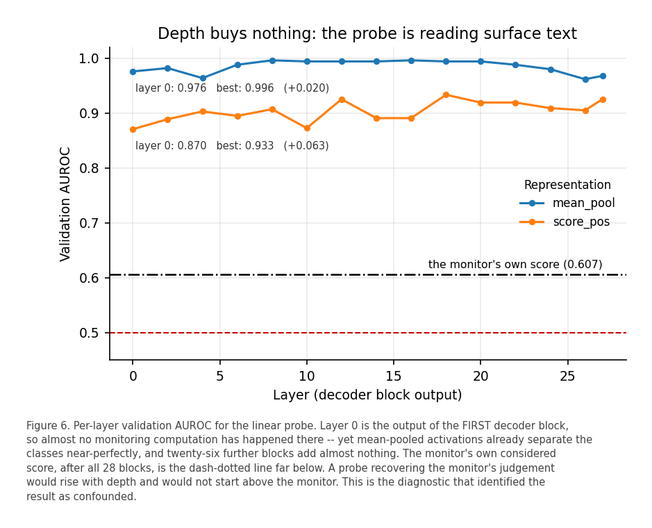

# Stop taking the argmax (and a control you should be running)

I set out to test whether linear probes on a trusted monitor's activations
transfer to attack families they were never trained on. **They don't — but I
couldn't answer that question, because the dataset can't support it.** A probe
scoring 0.99 turned out to be reading which model wrote the transcript, and no
amount of matching removed it.

So this post reports what I found instead: a smaller, deployable result about
the monitor's *score* rather than its activations, an honest account of how weak
that result is in absolute terms, and one methodological control that I think is
the most transferable thing here. RQ2 was the plan; RQ1 is what survived.

## Two claims, scoped

These results point in different directions and are easy to reconcile wrongly,
so both are stated here before the evidence.

**What holds — the relative claim.** Reading the monitor's logit distribution
beats taking its argmax: **+0.031 AUROC [+0.009, +0.054]**, the preregistered
primary comparison. This is a *paired* comparison: the two channels are read
from the same tensor on the same forward pass over the same trajectories, with
identical supervision (none). Any property of the dataset — including all the
leakage described below — inflates both channels equally and cancels in the
difference. Nothing in this post undermines it.

**What does not hold — the absolute claim.** Neither channel demonstrates attack
*detection* on this dataset. A supervised logistic fit on trajectory shape
alone, reading no content, reaches **0.765**, above every content-reading
channel here and above mrt's own frontier monitor at 0.621. By the criterion I
registered before running the comparison, nothing here has demonstrated attack
detection in absolute terms.

The relative claim is the deployable one: it says use a different read-out of a
computation you are already performing. The absolute claim would need a dataset
whose labels are not recoverable from generation metadata — which, as it turns
out, this one is.

---

## The tie plateau

In an AI-control protocol an untrusted model does the work and a trusted monitor
reads the trajectory and returns a suspiciousness score — conventionally an
integer on 0–100. A small human audit budget goes to the highest scores.
Defer-to-trusted, defer-to-resample, audit allocation: all consume that scalar.

Lucassen & Kaufman report something in Appendix H.2 of *Retrying vs Resampling
in AI Control* (arXiv:2605.26047) that is easy to skim past. Under max-of-5
aggregation, **over 250 trajectories tie at a maximum score of 95**. Not "score
similarly" — tie exactly, with nothing to separate them. They note this degrades
auditing in the 4e-3 to 2e-4 FPR range, and patch it with a second-max
tie-break.

At the audit budgets a real deployment runs, then, the set of trajectories a
human actually looks at is decided substantially by **tie-breaking**, not by the
monitor's judgement. The monitor has an opinion. The integer throws most of it
away.

## Setup

Qwen2.5-7B-Instruct in 4-bit, reading agent trajectories from
[`ScaleAI/mrt`](https://huggingface.co/datasets/ScaleAI/mrt) — the dataset behind
*Reliable Weak-to-Strong Monitoring of LLM Agents* (arXiv:2508.19461). Every
channel is read from the **same forward pass** on the same trajectory.

| Channel | What it is | Trained? |
|---|---|---|
| `emitted` | the argmax-decoded integer — what everyone uses today | no |
| `logit_ev` | expected value `Σ p(v)·v` over the score-token distribution | no |
| `logit_logodds_T` | log-odds that the score exceeds threshold `T` | no |
| `probe` | L2 logistic probe on residual-stream activations | yes |
| `length_baseline` | rendered trajectory length, as a score | no |
| `structure_baseline` | cross-fitted logistic on message count, size, elisions | yes |

### Reading a distribution over a multi-token number

"95" is two tokens in the Qwen2.5 vocabulary; "100" is three. So you cannot read
a distribution over "score tokens" at one position. I build a trie over the
tokenisations of all 101 candidates and walk it using the KV cache from the
prefill — ten cached forwards of at most three tokens each.

One trap: a candidate that is a **prefix** of another ("1" of "19", "10" of
"100") only terminates there if the next token continues no other candidate.
Getting this wrong double-counts, and my first implementation reported total
candidate probability of **1.26** — a number that cannot exist. The fix weights
each prefix candidate by `1 − Σ p(continuing token)`. The bug was silent: it
produced plausible-looking scores.

---

## The control: if depth buys nothing, you are reading the input

This is the part I would most like people to take away, so it goes before the
narrative rather than after it.

I captured residual-stream activations at every second decoder block and swept a
linear probe across all of them. The result:

| Representation | Layer 0 (first block) | Best layer | Gain from 26 more blocks |
|---|---|---|---|
| `mean_pool` | **0.976** | 0.996 | **+0.020** |
| `score_pos` | 0.870 | 0.933 | +0.063 |

The monitor's own considered score, after all 28 blocks, is **0.607**.

A probe that is recovering *the monitor's judgement* should improve with depth,
because the judgement is what the later blocks compute. Here the signal is
essentially complete after **one** block — before any monitoring has happened —
and it starts far above what the monitor itself concludes. That is not a
judgement being decoded. It is a surface property of the input that the model
represents immediately and that correlates with the label for reasons having
nothing to do with attacks.

**The control, stated generally: fit your probe at the first decoder block as
well as your best layer. If the shallow probe matches the deep one, you are
reading the input, not the model's computation.** It costs one extra fit, it
needs no new data, and it would have caught this in minutes rather than after a
full transfer analysis.

## What the probe was actually reading

Stage 3 returned a probe at **AUROC 0.989** against the monitor's own emitted
score at 0.655. Three confounds, removed in turn:

**1. Agent identity predicts the label at AUROC 0.805 with no text at all.**
mrt's sample is severely imbalanced by generating agent: `claude-3-5-haiku` is
105 benign / 0 attack; `gemini-2.5-pro` is 0 benign / 17 attack; `o3` is 3 / 36.
**29.4% of trajectories come from a model that is more than 95% one-sided.** A
probe that recognises writing style gets those free. Restricting to a single
generating model: **the probe stayed at 1.000.**

**2. Not one of the 175 benign trajectories contains a `<model_thinking>`
block.** Benign runs were generated without a thinking scaffold, most attack
families with one. Stripped-thinking-block count alone separates the classes at
**0.783 — better than the monitor's own score.** Matching on it (124 attacks
with zero thinking blocks, paired with the 175 benign): **the probe stayed at
0.980.**

**3. Whatever remains is present after one block.** See above.

**RQ2 is not answerable on mrt.** Benign and attack trajectories differ by
shallow surface statistics, and a linear probe finds them instantly. Any
probe-versus-monitor comparison here measures dataset artefacts.

This is a concrete instance of the arXiv:2509.21344 critique, that probes lean
on textual evidence rather than privileged internal state. My preregistration
claimed that critique did not apply here because the monitor's only input is
text. That reasoning protects the *monitor* and says nothing about the *probe*,
which reads activations encoding the input's surface form. I was wrong, and the
depth-gain control is what caught it.

---

## RQ1: the result that survived

### Resolution, full sample (905 trajectories, 506 benign / 399 attack)

| Channel | AUROC | Distinct values | **Resolution floor (FPR)** |
|---|---|---|---|
| `emitted` | 0.655 [0.621, 0.689] | **18** | **0.0731** |
| `logit_ev` | 0.675 [0.640, 0.709] | 905 | **0.0020** |

The resolution floor is the lowest false-positive rate at which a channel can
express *any* audit budget. The emitted integer's floor is **7.3%**: its top
score bucket alone holds 37 benign trajectories, so below 7.3% FPR there is no
operating point and the audit set is decided by whatever breaks the tie. The
continuous channel reaches **0.2%**, the sample's own floor (1/506).

**A 36× improvement in usable audit depth, from one forward pass, no training.**
This is a claim about *granularity*, and it is independent of what drives the
score — which matters, given everything below.

### Discrimination, matched subset (299 trajectories)

With both confounds controlled — one generating model, thinking-block presence
matched. Paired bootstrap on the difference, 4,000 resamples over trajectories:

| Comparison | Δ AUROC | 95% CI | |
|---|---|---|---|
| **`logit_ev` − `emitted`** | **+0.031** | **[+0.009, +0.054]** | preregistered comparison #1 |
| `logit_logodds_80` − `emitted` | +0.056 | [+0.028, +0.086] | swept threshold |
| `logit_logodds_90` − `emitted` | +0.095 | [+0.049, +0.143] | **best of three swept thresholds** |

**The headline is `logit_ev`: +0.031 [+0.009, +0.054].** It is a single fixed
statistic with nothing to tune, and it is comparison #1 in the preregistration.
Reading the expected value instead of taking the argmax beats the integer,
significantly, for free.

**The log-odds numbers are a tuned maximum and I am not leading with them.**
`logit_logodds_90 = +0.095` is the best of three thresholds `{50, 80, 90}`,
selected on the same data it is reported on. The threshold values were fixed in
code about four hours before any monitor output existed — so they were not
chosen to fit results — but they are not in the preregistration, no threshold was
designated primary, and the preregistration budgeted **one** log-odds comparison
where three were run. **Three thresholds tested, best reported, no multiplicity
correction applied.**

And the ranking is unstable across samples:

| Channel | Full sample (n=905) | Matched subset (n=299) |
|---|---|---|
| `logit_ev` | 0.675 | 0.638 |
| `logodds_50` | 0.666 | **0.617** (worst) |
| `logodds_80` | **0.676** (best) | 0.663 |
| `logodds_90` | **0.659** (worst) | **0.702** (best) |

`logodds_90` is the *worst* log-odds channel on the full sample and the *best* on
the matched subset. Treat any specific threshold as unvalidated. The robust
claim is the direction — read the distribution, don't take the argmax — and
`logit_ev` carries it without a knob.

---

## How weak is this in absolute terms? Weaker than I first reported.

I set a criterion earlier in the project: any channel that fails to clearly beat
a baseline reading only trajectory *shape* has not demonstrated that it detects
attacks. Applied properly, **no channel passes.**

`structure_baseline` is a logistic regression on message count, rendered size and
elision counts — no content at all — cross-fitted 5-fold so every trajectory
gets a score from a model that never saw it:

| Channel | AUROC | Δ vs structure | 95% CI |
|---|---|---|---|
| **`structure_baseline`** | **0.765 [0.707, 0.820]** | — | — |
| `logit_logodds_90` | 0.702 | −0.063 | [−0.143, +0.018] |
| `logit_logodds_80` | 0.663 | −0.102 | [−0.188, −0.017] |
| `logit_ev` | 0.638 | −0.127 | [−0.213, −0.044] |
| `emitted` | 0.607 | −0.159 | [−0.244, −0.076] |

**The best channel is statistically indistinguishable from trajectory shape.
Every other channel, including the monitor's own emitted score, is significantly
worse than it.**

One asymmetry to state plainly: `structure_baseline` is fit on labels while the
logit channels are zero-shot. A supervised model beating a zero-shot one on the
same 299 trajectories is the expected direction, so beating it would have been a
strong result and losing to it is a weak failure. But the honest summary is that
absolute discrimination on this subset is weak enough that trajectory shape
accounts for it.

**What this does not touch** is the within-channel comparison. `logit_ev` versus
`emitted` is computed on identical trajectories with identical supervision
(none). The argmax discards information relative to the distribution whatever the
absolute level, and the resolution result is a property of the scale itself.

### The matching introduced a confound while removing one

`length_baseline` scores **0.514 on the full sample** and **0.610 on the matched
subset**. The mechanism, measured:

| Group | mean rendered chars | n |
|---|---|---|
| benign | 34,018 | 506 |
| attacks **retained** (zero thinking) | **37,336** | 124 |
| attacks **dropped** (has thinking) | **24,943** | 275 |

On the full sample the long retained attacks and short dropped attacks straddle
the benign mean and cancel out, giving chance. Keeping only the retained ones
leaves attacks systematically longer than benign, and length becomes predictive.
**The zero-thinking selection is not length-neutral.**

An earlier draft of this post called "the emitted integer does not beat
trajectory length" the most damning line in it. That was overstated twice over:
the two are 0.607 [0.539, 0.671] and 0.610 [0.543, 0.674] — a null with heavily
overlapping intervals — and the length figure is partly an artefact of the
matching rather than a fact about monitors. The supportable version is that on
this subset the emitted score is statistically indistinguishable from a length
baseline while `logit_logodds_90` is not, and that is in any case subordinate to
the structure-baseline result above.

---

## mrt's labels are recoverable without reading the trajectory

The structure-baseline result above is not really a fact about my channels. It
is a fact about the dataset, and it generalises past this project.

Four signals recover mrt's class labels. Three of them read **no content at
all** — they are functions of how each trajectory was generated, not of what the
agent did:

| Signal | Reads content? | AUROC | Population |
|---|---|---|---|
| Agent identity alone | no | **0.805** | full sample, n=905 |
| Trajectory structure, cross-fitted | no | **0.765** | matched subset, n=299 |
| Thinking-block presence alone | no | **0.758** | full sample, n=905 |
| This project's 7B monitor (emitted) | yes | 0.655 | full sample, n=905 |
| **mrt's own frontier monitor** | yes | **0.621** | full sample, n=1,138 |

"Trajectory structure" is a logistic regression on message count, rendered size
and elision counts, cross-fitted 5-fold. "Agent identity" is the per-model
attack rate, using no text whatsoever.

**The best attack detector in this entire experiment does not read the
trajectory.** Every metadata signal outranks both content-reading monitors,
including the frontier model mrt itself used.

The mechanism is documented in detail earlier in this post and is not subtle:
benign and attack trajectories were produced by different generation pipelines.
`claude-3-5-haiku` contributed 105 benign runs and 0 attacks; `gemini-2.5-pro`
contributed 17 attacks and 0 benign. Not one of the 175 benign trajectories in
the agent-restricted subset contains a `<model_thinking>` block, because benign
runs were generated without a thinking scaffold and most attack families with
one. Those choices are invisible in the trajectory text but are perfectly
legible in its shape and style.

**What this means if you use mrt.** An uncontrolled monitor comparison on this
dataset is partly measuring generation artefacts rather than detection ability.
At minimum, control for the generating model and for scaffold presence, and
report a structure-only baseline alongside your monitor. If your monitor does
not beat 0.765 on a matched subset, you have not yet shown it is reading the
attack.

**This is not a criticism of the dataset.** mrt was built as a *monitor
red-teaming* resource — a corpus of attacks adversarially optimised to evade
monitors — and it is entirely fit for that purpose. Its per-family structure is
exactly what you want for red-teaming: `naive` attacks are caught at 0.878 while
`monitor_manipulation` sits at 0.349, below chance. The leakage only bites when
the corpus is repurposed as a *detection* benchmark and the two classes are
compared directly, which is what this project tried to do. That repurposing is
the error, and it was mine.

## What this means for control protocols

**Stop taking the argmax.** One line of code. You already run the forward pass
and already have the logits, and you are discarding the part that carries the
tail resolution your audit budget depends on. The effect is small but real and
free: +0.031 AUROC, and 36× more usable audit depth.

**Use the expected value unless you have validated a threshold.** Log-odds looked
better here, but which threshold wins flips between samples. `logit_ev` has no
knob.

**Run the depth-gain control on any activation probe.** Fit at the first decoder
block as well as your best layer. If they match, you are reading the input.

**Be sceptical of activation probes on agent-trajectory datasets.** Not because
probes cannot work, but because benign and attack trajectories in these corpora
are typically generated by different pipelines, and that difference is trivially
decodable. Match on generating model and on scaffold, and check what is left.

**Treat mrt as an evasion benchmark, not a detection benchmark.** Its own
frontier monitor reaches AUROC 0.621 on these labels. Per family, `naive`
attacks are caught at 0.878, but `selective_thinking` sits at 0.497 and
`monitor_manipulation` at **0.349** — those attacks read as *less* suspicious
than genuinely benign runs. That is what the dataset was built to contain.

## Limitations

- **Absolute discrimination is weak and does not beat a structural baseline.**
  See above. The comparative claims are paired and survive; the absolute ones do
  not.
- **The matched subset removes two confounds and is not guaranteed neutral with
  respect to others.** `length_baseline` moving from 0.514 to 0.610 is direct
  evidence of exactly that. There may be further artefacts I did not find.
- **The matched subset is enriched for evasive families** — `monitor_manipulation`
  (57), `no_thinking` (39), `jailbreak` (19) — because those are the families
  generated without a thinking scaffold. Absolute AUROCs are pessimistic there.
- **A small open monitor, not a frontier model**, and a single model family
  (Qwen2.5). No cross-family replication.
- **mrt is SHADE-Arena-derived, not BashArena.** Benign trajectories exist *only*
  in the five SHADE-Arena tasks.
- **FPR = 3e-4 is unreachable here.** mrt yields ~738 distinct benign
  trajectories; expressing 3e-4 needs at least 3,333. Reported as unreachable
  rather than fabricated.
- **The probe results are reported as confounded, not as findings.**

## Deviations from preregistration

1. **The agent-model restriction was reversed, then reinstated.** Widening it to
   gain negatives was a mistake and the probe analysis paid for it.
   (D-008, D-016, D-030, D-031.)
2. **Log-odds thresholds were not preregistered.** The set `{50, 80, 90}` was
   fixed in code before any monitor output existed but after the preregistration
   commit; the document budgeted one log-odds comparison, three were run, best
   reported, no correction. (D-033.)
3. **FPR = 3e-4 and 3e-3 are not reachable** on this dataset; reported with a
   reachability flag. (D-017.)
4. **`length_baseline` and `structure_baseline` added** as controls — the first
   before any monitor was run, the second after the confound was found.
   (D-012, D-032, D-034.)
5. **Gate 1 was passed on a judgement call**, not the letter of the criterion:
   emitted AUROC at n=60 was 0.572, below the 0.60 bar, on a benchmark whose own
   frontier monitor reaches 0.621. At full sample the criterion is met (0.655
   [0.621, 0.689]). (D-026.)
6. **Trajectory count cut from 1,154 to 905** for compute budget, protecting all
   negatives and balancing attack families. (D-029.)

## Compute

15.4 hours wall-clock on a single RTX 5070 Laptop GPU (8 GB), roughly 11.5 of
them GPU-bound. Peak VRAM 6.82 GB.

The host hard-reset twice under sustained load, both times with bugcheck
`0x00020001` and identical parameters. The fix that mattered was not defensive
tuning but an efficiency bug: the long-context prefill was running **twice** per
trajectory. Prefilling once, in chunks, and reusing the KV cache for both
generation and activation capture cut per-trajectory time from 33 s to 7 s and
peak VRAM from 4.7 GB to 2.8 GB. `CRASH_MITIGATION.md` has the evidence.

## Reproducing

Everything is at
[github.com/ShreyasVR2545/probing-trusted-monitors](https://github.com/ShreyasVR2545/probing-trusted-monitors).
`PREREGISTRATION.md` was committed before any result existed. `DECISIONS.md`
logs all 35 judgement calls with reasoning, including the wrong ones: D-022 and
D-023 are a prediction I made and then falsified, D-030 is where the headline
died, and D-034 is where I applied my own criterion and failed it.
